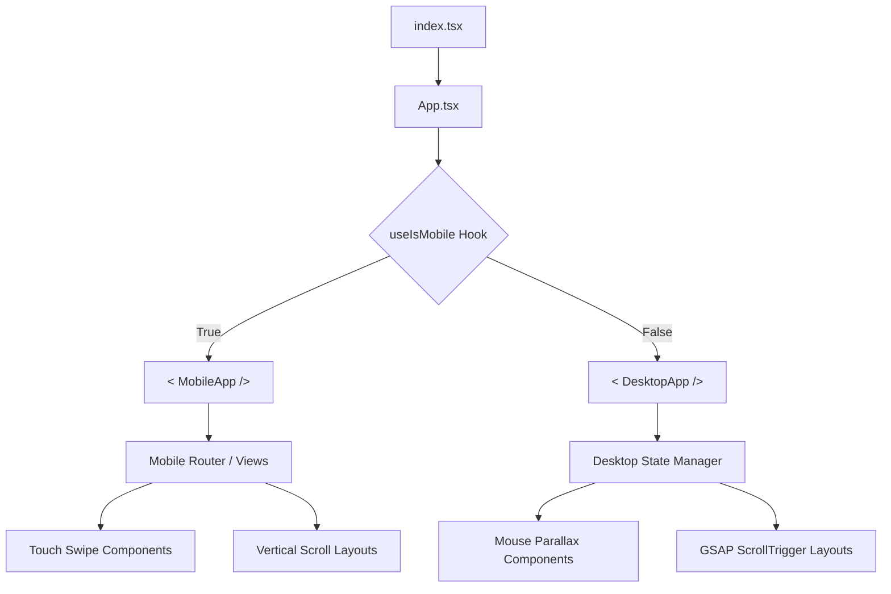

# Forte-FY Project Architecture & File Guide

## 🏛️ High-Level Architecture

This project utilizes a **Split-Architecture Strategy**. Instead of using CSS media queries for complex layout changes, the application detects the device type at the React root level and renders completely different component trees. This allows for heavy GSAP animations on Desktop and touch-optimized interactions on Mobile without conflict.



---

## 📂 File Structure Hierarchy

```text
.
├── index.tsx ......................... Entry point redirector
├── metadata.json ..................... Project config & permissions
│
└── forte-fy/ ......................... MAIN SOURCE DIRECTORY
    │
    ├── index.html .................... HTML Template (Fonts, Tailwind, Global CSS)
    ├── index.tsx ..................... React DOM Root
    ├── App.tsx ....................... Primary Router (Splits Mobile/Desktop)
    ├── constants.tsx ................. Data Database (Content, Members, Stats)
    ├── types.ts ...................... TypeScript Interfaces
    │
    ├── 🪝 hooks/
    │   └── useIsMobile.ts ............ Resize listener to detect <768px devices
    │
    ├── 🧠 services/
    │   └── geminiService.ts .......... Google GenAI integration for Impact Vision
    │
    ├── 🧩 components/ ................ SHARED & DESKTOP UI
    │   ├── DepartmentCard.tsx ........ 3D Tilt Card for Desktop Grid
    │   ├── KineticDepartmentCard.tsx . Touch-physics Card for Mobile
    │   ├── DepartmentsView.tsx ....... Desktop Grid Layout for Depts
    │   ├── DepartmentDetailView.tsx .. Routing logic for Dept Details
    │   ├── ImpactGenerator.tsx ....... AI Vision Generator Component
    │   ├── ScrollReveal.tsx .......... Animation Wrapper (Fade-in on scroll)
    │   ├── SmartImage.tsx ............ Performance optimized Image component
    │   ├── Header.tsx ................ (Legacy) Generic Header
    │   ├── PCMenuMainPage.tsx ........ Full-screen Bento Grid Menu (Desktop)
    │   ├── MobileMenuMainPage.tsx .... Full-screen Bento Grid Menu (Mobile)
    │   │
    │   ├── 📄 pages/ ................. DESKTOP MAIN SECTIONS
    │   │   ├── StoryPage.tsx ......... "Legacy" / History Section
    │   │   ├── EventsPage.tsx ........ "Archive" / Event Portfolio
    │   │   ├── HallOfFamePage.tsx .... "Apex Circle" / Awards
    │   │   ├── AlumniPage.tsx ........ Alumni Network
    │   │   ├── PanelPage.tsx ......... Current Executive Board
    │   │   │
    │   │   ├── 🌑 event_pages/ ....... DARK MODE EVENT DETAILS
    │   │   │   ├── CosmicQuest.tsx
    │   │   │   ├── MosaicStories.tsx
    │   │   │   ├── SpiritualQuest.tsx
    │   │   │   └── BrushFlash.tsx
    │   │   │
    │   │   └── ☀️ event_pages_light/ .. LIGHT MODE EVENT DETAILS
    │   │       ├── CosmicQuestLight.tsx
    │   │       ├── MosaicStoriesLight.tsx
    │   │       ├── SpiritualQuestLight.tsx
    │   │       └── BrushFlashLight.tsx
    │   │
    │   └── 🏢 departments/ ........... DESKTOP DEPARTMENT PAGES
    │       ├── HRDepartment.tsx ...... Human Resources
    │       ├── PRDepartment.tsx ...... Public Relations
    │       ├── ITDepartment.tsx ...... Info Tech (The Atelier)
    │       ├── OpsDepartment.tsx ..... Operations (Dark)
    │       ├── Ops_Light.tsx ......... Operations (Light)
    │       ├── AcadDepartment.tsx .... Academics (Dark)
    │       ├── Acad_Light.tsx ........ Academics (Light)
    │       │
    │       └── 📱 Mobile_Departments/  MOBILE DEPARTMENT PAGES
    │           ├── MobHRDepartment.tsx
    │           ├── MobPRDepartment.tsx
    │           ├── MobITDepartment.tsx
    │           ├── MobOpsDepartment.tsx
    │           ├── MobAcadDepartment.tsx
    │           │
    │           └── ☀️ Light_Mobile_Departments/
    │               ├── MobHRDepartment_light.tsx
    │               ├── MobPRDepartment_light.tsx
    │               ├── MobITDepartment_light.tsx
    │               ├── MobOpsDepartment_light.tsx
    │               └── MobAcadDepartment_light.tsx
    │
    ├── 🧱 code/ ...................... REUSABLE DEPARTMENT NAVS
    │   ├── HRHeaderFooter.tsx ........ Nav specific to HR theme (Purple)
    │   ├── PRHeaderFooter.tsx ........ Nav specific to PR theme (Crimson)
    │   ├── ITHeaderFooter.tsx ........ Nav specific to IT theme (Cyan)
    │   ├── OpsHeaderFooter.tsx ....... Nav specific to Ops theme (Orange)
    │   └── AcadHeaderFooter.tsx ...... Nav specific to Acad theme (Blue)
    │
    └── 📱 mobile/ .................... MOBILE APP ROOT
        ├── MobileApp.tsx ............. Mobile-specific Router & Layout
        │
        └── 📄 pages/
            ├── MobileDepartmentsView.tsx  Grid view for Mobile
            ├── MobileStory.tsx ....... (Legacy Wrapper)
            ├── MobileEvents.tsx ...... (Legacy Wrapper)
            ├── MobileHallOfFame.tsx .. (Legacy Wrapper)
            │
            ├── EventsForMobile/ ...... MOBILE EVENT DETAILS
            │   ├── CosmicQuest.tsx
            │   ├── MosaicStories.tsx
            │   ├── SpiritualQuest.tsx
            │   └── BrushFlash.tsx
            │
            └── 📄 MainMenuPagesMobile/  MOBILE MAIN SECTIONS
                ├── StoryPageMobile.tsx
                ├── EventsPageMobile.tsx
                ├── HallOfFamePageMobile.tsx
                ├── AlumniPageMobile.tsx
                └── PanelPageMobile.tsx
```

---

## 🔑 Key Component Breakdowns

### 1. `DesktopApp.tsx`
*   **Role:** The "Brain" of the desktop experience.
*   **Function:** Manages the main vertical scroll layout, the global Navigation Bar, the Footer, and switches views based on user interaction (e.g., clicking a department card swaps the main view to `DepartmentDetailView`).

### 2. `MobileApp.tsx`
*   **Role:** The "Brain" of the mobile experience.
*   **Function:** Renders a touch-friendly layout. It uses a fixed header with a hamburger menu (`MobileMenuMainPage`) and manages routing state internally to switch between Home, Events, and Departments without reloading.

### 3. `DepartmentCard.tsx` (Desktop) vs `KineticDepartmentCard.tsx` (Mobile)
*   **Desktop:** Uses mouse-move events to create a 3D tilt effect and a spotlight glare that follows the cursor.
*   **Mobile:** Uses device gyroscope (simulated via touch drag) and CSS sheen animations to make cards feel "alive" under a thumb press.

### 4. `geminiService.ts`
*   **Role:** Intelligence Layer.
*   **Function:** Connects to Google's Gemini API. It sends prompts based on user input (in `ImpactGenerator.tsx`) to generate custom "Impact Visions" or "Skill Roadmaps" dynamically.

### 5. `constants.tsx`
*   **Role:** Single Source of Truth.
*   **Function:** Contains all static data (Event statistics, Member names, Partner logos, Department descriptions). Editing this file updates content across the entire app (Mobile & Desktop) instantly.
